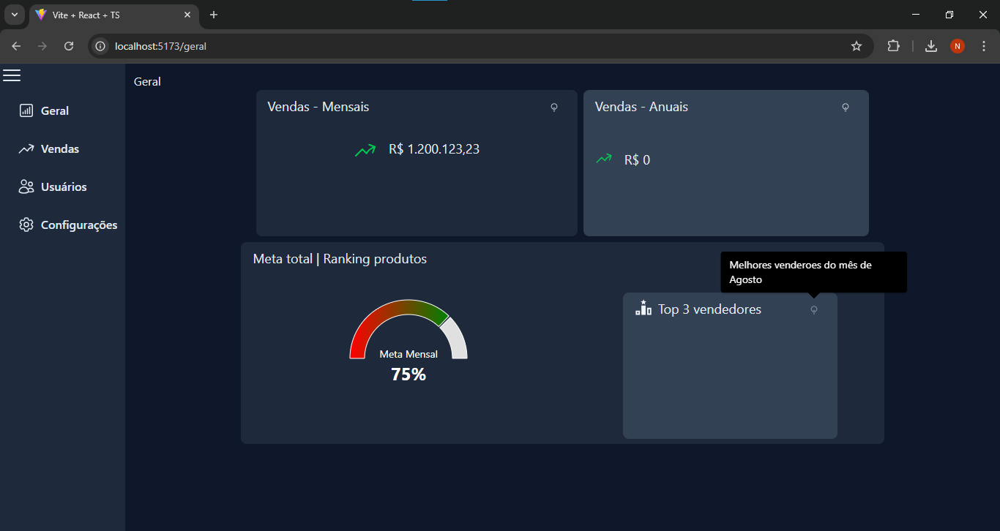

# WebDashboard

O **WebDashboard** é um projeto de painel de controle desenvolvido com **React**, **TypeScript** e **Vite**, visando fornecer uma base sólida para aplicações web modernas e responsivas.

## 🖼️ Layout

Veja abaixo uma prévia da interface:



## 🚀 Tecnologias Utilizadas

- [React](https://reactjs.org/)
- [TypeScript](https://www.typescriptlang.org/)
- [Vite](https://vitejs.dev/)
- [ESLint](https://eslint.org/)

## 📁 Estrutura do Projeto

O projeto está organizado da seguinte forma:

```
WebDashboard/
├── public/
├── src/
│   ├── components/
│   ├── pages/
│   ├── App.tsx
│   └── main.tsx
├── .env.development
├── .gitignore
├── index.html
├── package.json
├── tsconfig.json
├── vite.config.ts
└── yarn.lock
```

## ⚙️ Instalação e Execução

1. **Clone o repositório:**

   ```bash
   git clone https://github.com/natanmarques65/WebDashboard.git
   cd WebDashboard
   ```

2. **Instale as dependências:**

   ```bash
   yarn install
   ```

3. **Inicie o servidor de desenvolvimento:**

   ```bash
   yarn dev
   ```

   O aplicativo estará disponível em `http://localhost:5173`.

## 🔗 Integração com a API

Este dashboard pode ser integrado com o backend disponível em:  
👉 [https://github.com/natanmarques65/ApiDashboard](https://github.com/natanmarques65/ApiDashboard)

### Passos para integração:

1. Clone o repositório da API:

   ```bash
   git clone https://github.com/natanmarques65/ApiDashboard.git
   cd ApiDashboard
   ```

2. Configure o arquivo `.env` com as variáveis de ambiente necessárias para conectar ao banco de dados.

3. Execute a API:

   ```bash
   dotnet run
   ```

4. No frontend (WebDashboard), configure a variável `VITE_API_URL` no arquivo `.env.development` apontando para a URL da API:
   ```
   VITE_API_URL=http://localhost:5000
   ```

## 🧪 Scripts Disponíveis

- `yarn dev` – Inicia o servidor de desenvolvimento com recarregamento automático.
- `yarn build` – Compila o projeto para produção.
- `yarn preview` – Visualiza a versão de produção localmente.

---

Para mais informações, visite o repositório oficial: [https://github.com/natanmarques65/WebDashboard](https://github.com/natanmarques65/WebDashboard)
